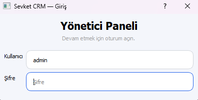
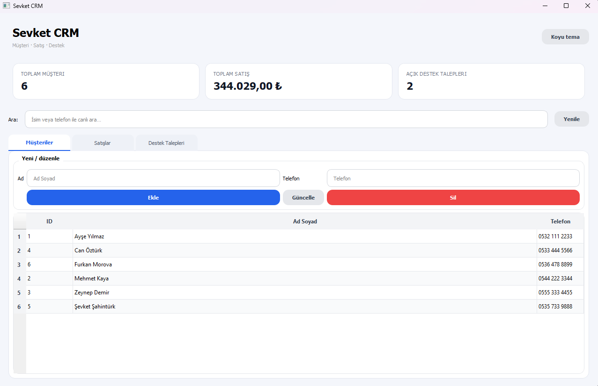
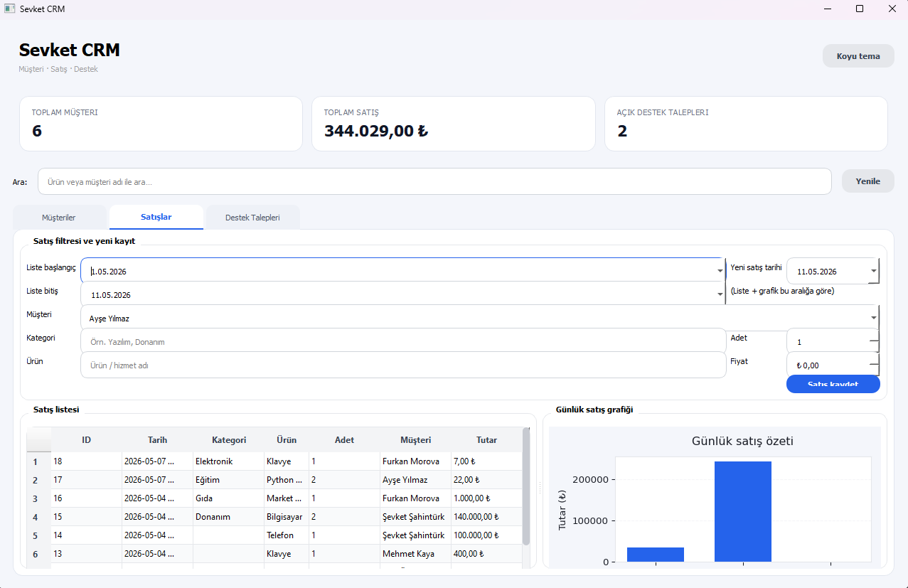
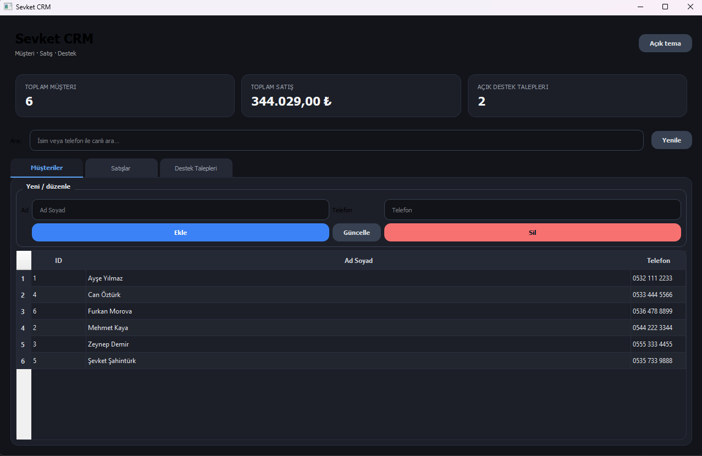

# Şevket CRM

Şevket CRM, işletmelerin müşteri ilişkilerini, satışlarını ve destek taleplerini kolayca yönetebilmeleri için geliştirilmiş, **Python ve PyQt5** tabanlı modern bir masaüstü uygulamasıdır. Yerel **SQLite** veritabanı kullanarak internet bağlantısına ihtiyaç duymadan, hızlı ve güvenli bir deneyim sunar.

## 🚀 Özellikler

- **Müşteri Yönetimi:** Müşterileri ekleyin, düzenleyin veya silin. Canlı arama özelliği ile binlerce kayıt arasından saniyeler içinde istediğiniz müşteriyi bulun.
- **Gelişmiş Satış Takibi:** Satışları ürün, kategori, adet ve tutar bazlı kaydedin. İki tarih arası filtreleme yaparak satış listelerini kolayca daraltın.
- **İnteraktif Satış Grafikleri:** Belirlediğiniz tarih aralığındaki günlük satış trendlerini dinamik grafikler üzerinden görsel olarak inceleyin.
- **Destek Talebi (Ticket) Sistemi:** Müşterilerinizin şikayet veya taleplerini sisteme girin. Açık ve Kapalı durumlarına göre filtreleyip süreç takibini yapın.
- **Özet Dashboard (Pano):** Toplam müşteri sayısı, toplam ciro ve açık destek taleplerini tek ekranda anlık olarak görün.
- **Modern Arayüz & Tema Desteği:** Tek tıkla değiştirilebilen Açık (Light) ve Koyu (Dark) tema seçenekleriyle göz yormayan, şık ve kullanıcı dostu arayüz.

## 📸 Ekran Görüntüleri

*admin login ekranı arayüzü*

*Ana ekran, özet istatistikler ve modern müşteri arayüzü.*

*Gelişmiş satış filtreleme ve günlük satış grafiği sekmesi.*

*Göz yormayan koyu (dark) tema seçeneği.*

## 🛠️ Kullanılan Teknolojiler

- **Programlama Dili:** Python 3.8+
- **Arayüz (GUI):** PyQt5
- **Veritabanı:** SQLite (Yerel depolama)
- **Mimari:** Modüler, nesne yönelimli tasarım (Veritabanı, Modeller, Servisler ve UI katmanları olarak ayrılmış temiz mimari)

## 🗄️ Veritabanı ve Mimari Detayları

- Veritabanı dosyası varsayılan olarak kullanıcı dizininde (Örn: `C:\Users\KullaniciAdiniz\.SevketCRM\crm_data.sqlite`) güvenli bir şekilde saklanır.
- Uygulama ilk kez açıldığında, tablolar `db/database.py` dosyası üzerinden otomatik oluşturulur (`kullanici`, `musteri`, `satis`, `destek_talebi`).
- **Modüler Yapı:** Model sınıfları (`models/`) sadece iş kurallarını ve CRUD (Ekle, Sil, Güncelle, Listele) operasyonlarını yönetir. Arayüz sınıfları (`ui/`) ise sadece kullanıcı etkileşimleriyle ilgilenir. Bu yapı sayesinde kodun okunabilirliği ve bakımı son derece kolaydır.
